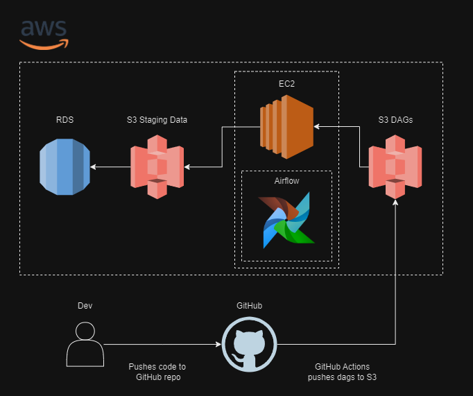

# Main

This project is an ETL pipeline built using Apache Airflow, designed to efficiently manage and automate data scraping tasks from multiple sources. The infrastructure is deployed on an EC2 instance with S3 buckets for storing DAGs (Directed Acyclic Graphs) and staging data, and an RDS (Relational Database Service) for storing the final datasets.

The core of the project is a dynamic framework that allows for the easy creation of multiple scrapes (DAGs) based on a YAML configuration file. This setup streamlines the process of extracting, transforming, and loading data into the RDS. The DAGs and their dependencies are version-controlled and deployed through a CI/CD pipeline, ensuring that the S3 bucket and the Airflow instance remain in sync. This infrastructure provides a scalable solution for writing and deploying custom data scraping tasks, enabling efficient data management and processing.

**Schematic of Airflow Architecture**:

The second half of this project is...

## Data Warehousing Architecture

### Part 1: Cloud Infrastructure Set-Up

In this section, we establish the foundational cloud infrastructure required to run our ETL pipeline using AWS services. The key components include:

1. **Identity and Access Management (IAM)**:
   - **User and Group Setup**: Creation of a dedicated IAM user (`data-pipeline`) and an IAM group (`data-pipeline-group`) to manage permissions securely.
   - **Policy Creation**: Definition of a custom IAM policy to provide the necessary permissions to access S3 buckets, EC2 instances, and RDS databases.

2. **Amazon S3**:
   - **Bucket Creation**: Creation of two S3 buckets—one for storing DAGs (`data-pipeline-airflow-dags`) and another for staging data (`data-pipeline-staging-data`).

3. **Amazon RDS**:
   - **Database Setup**: Creation of an RDS PostgreSQL database (`data-pipeline-database`) to store the final datasets, with appropriate security groups configured.

4. **Amazon EC2**:
   - **Instance Launch**: Launching an EC2 instance (`airflow-server`) with Ubuntu, which hosts the Airflow server.
   - **Elastic IP**: Allocation of an Elastic IP for a static address to access the Airflow server.

5. **Airflow Installation**:
   - **Environment Setup**: Configuration of the EC2 instance with Python, installation of Airflow in a virtual environment, and setup of the Airflow web server and scheduler to start automatically.

6. **AWS CLI Installation**:
   - **CLI Installation**: Installation of AWS CLI on the EC2 instance to interact with AWS services.

7. **IAM Credentials Configuration on EC2**:
   - **Credentials Configuration**: Setup of IAM credentials on the EC2 instance for secure interaction with AWS services.

8. **CI/CD Pipeline Setup**:
   - **GitHub Actions**: Configuration of a GitHub Actions pipeline to automate the deployment of DAGs and their dependencies, maintaining synchronization between the S3 bucket and the EC2 server.

For detailed instructions on setting up the cloud infrastructure, please refer to the [AWS Service Setup](https://github.com/aaAbdulkadir/cloud-data-project-1/blob/main/notes/cloud_setup.md) notes.

### Part 2: Developing Airflow Infrastructure/Codebase

In this part, we focus on developing the Airflow infrastructure and the codebase needed to manage and execute the ETL processes:

1. **Dynamic DAG Framework**:
   - We implement a dynamic framework that enables the generation of multiple DAGs from YAML configuration files. This includes defining task sequences, dependencies, and scheduling directly through YAML, making it easier to create and manage various ETL processes.

2. **Scrape Structure**:
   - **Functions File**: Contains core business logic for `extract`, `transform`, and `load` operations.
   - **Helper Functions File**: Reusable functions that assist in maintaining clean and manageable code.
   - **YAML Configuration**: Specifies the DAG structure, including tasks, dependencies, and scheduling parameters.
   - **Testing**: Includes component tests for the core functions and unit tests for helper functions to ensure reliability and correctness.

3. **Task Management**:
   - **Task Wrapper**: A central mechanism that handles file management, task execution, and data transfer between S3 and PostgreSQL, while also supporting XCom integration and file comparison checks.

This section details the development and configuration of the Airflow infrastructure, ensuring efficient management and execution of the ETL pipeline. Please refer to the [Understanding the Code Base](https://github.com/aaAbdulkadir/cloud-data-project-1/blob/main/notes/code_setup.md) notes.

### Part 3: Data Warehousing

In this section, we focus on setting up and managing data warehousing using Amazon Redshift and Lambda functions, migrating the data from RDS to Redshift, using the New York taxi dataset as the data of interest for analysis.

1. **Setting Up Redshift**:
   - **Create Redshift Cluster**
   - **Redshift Table Creation**: Define tables and relationships based on the datase.

2. **Setting Up Lambda**:
   - **Create Lambda Function**.
   - **Add Code**: Implement Python code to transfer data from RDS to Redshift, including table creation and data insertion.
   - **Configure Environment Variables**: Set database connection parameters for RDS and Redshift.
   - **Add Layer**: Use Docker to create a layer with required dependencies (`psycopg2-binary`, `pandas`), and attach it to the Lambda function.
   - **Add Trigger**: Set up an S3 trigger for Lambda to activate on new `.csv` files in a specific bucket prefix.

For detailed instructions on setting up Redshift and Lambda, refer to the [Data Warehousing Setup](https://github.com/aaAbdulkadir/cloud-data-project-1/blob/main/notes/datawarehouse_setup.md) notes.

# Improvements

- **Add Upsert to Load Mode**: Integrate upsert functionality to handle data updates.
- **Scalability of Airflow Pipeline**: Enhance Airflow pipeline to handle larger datasets and improve performance.
