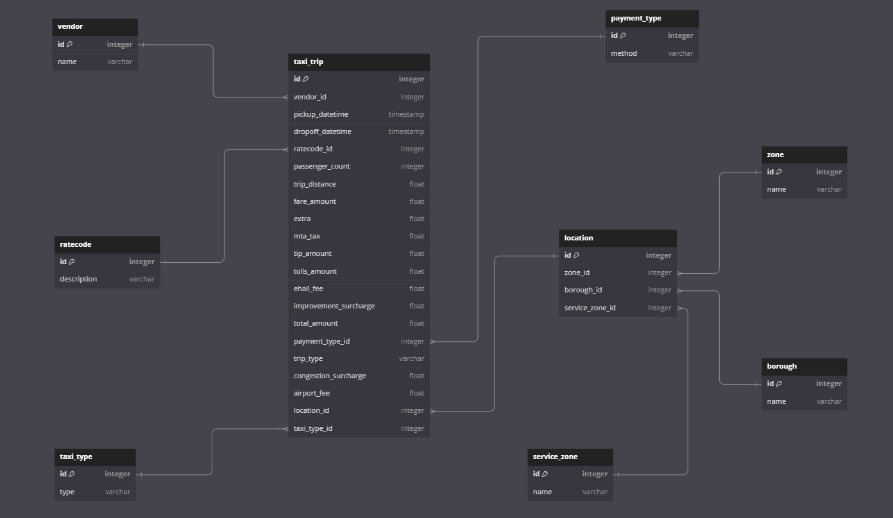

# Data Warehousing Setup 

Create lambda function to move data from RDS to Redshift


## 1. Setting up Redshift

1. Navigate to the **Amazon Redshift** console

2. Click **Create cluster**

   * Select **ra3.xplus** for the node type
   * Add your own admin username and password
   * Click on **Create cluster**

3. Make the cluster databse public

   * Click on **Actions** and **Modify publicly accessible setting**, making it public
   * Go the security group and access access to anywhere iPv4

## 2. Setting up Lambda 

1. Click **Create a function**

   - Name `rds_to_redshift`
   - Runtime: python 3.11
   - Click **Create function**


2. Add this code to the function

```python
import os 
import psycopg2
import pandas as pd
from psycopg2 import extras

def lambda_handler(event, context):
    try:
        print("Starting Lambda function")

        # Fetch RDS connection parameters from environment variables
        rds_host = os.getenv('RDS_HOST')
        rds_port = int(os.getenv('RDS_PORT'))
        rds_user = os.getenv('RDS_USER')
        rds_password = os.getenv('RDS_PASSWORD')
        rds_database = os.getenv('RDS_DATABASE')

        print(f"RDS connection parameters: {rds_host}, {rds_port}, {rds_user}")

        # Fetch Redshift connection parameters from environment variables
        redshift_host = os.getenv('REDSHIFT_HOST')
        redshift_port = int(os.getenv('REDSHIFT_PORT'))
        redshift_user = os.getenv('REDSHIFT_USER')
        redshift_password = os.getenv('REDSHIFT_PASSWORD')
        redshift_database = os.getenv('REDSHIFT_DATABASE')

        print(f"Redshift connection parameters: {redshift_host}, {redshift_port}, {redshift_user}")

        # Connect to RDS
        conn_rds = psycopg2.connect(
            host=rds_host,
            port=rds_port,
            user=rds_user,
            password=rds_password,
            database=rds_database
        )

        print("Connected to RDS")

        # Fetch data into DataFrame
        df = pd.read_sql_query('SELECT * FROM new_york_taxi;', conn_rds)
        print(f"Fetched {len(df)} rows from RDS")

        # Close RDS connection
        conn_rds.close()

        # Mapping of pandas dtypes to SQL types
        dtype_mapping = {
            'int64': 'BIGINT',
            'float64': 'DOUBLE PRECISION',
            'object': 'TEXT',
            'datetime64[ns]': 'TIMESTAMP',
            'bool': 'BOOLEAN'
        }

        # Get the columns and corresponding SQL data types
        columns_with_types = []
        for col_name, dtype in zip(df.columns, df.dtypes):
            sql_type = dtype_mapping.get(str(dtype), 'TEXT')  # Default to TEXT if type not found
            columns_with_types.append(f"{col_name} {sql_type}")

        create_table_query = f"""
        CREATE TABLE IF NOT EXISTS new_york_taxi (
            {', '.join(columns_with_types)}
        );
        """

        # Connect to Redshift
        conn_redshift = psycopg2.connect(
            host=redshift_host,
            port=redshift_port,
            user=redshift_user,
            password=redshift_password,
            database=redshift_database
        )

        print("Connected to Redshift")

        cursor = conn_redshift.cursor()

        # Drop the table if it exists
        drop_table_query = "DROP TABLE IF EXISTS new_york_taxi;"
        cursor.execute(drop_table_query)
        conn_redshift.commit()
        print("Dropped existing table in Redshift")

        # Create the table
        cursor.execute(create_table_query)
        conn_redshift.commit()
        print("Created new table in Redshift")

        # Insert data into Redshift
        tuples = [tuple(x) for x in df.to_numpy()]
        cols = ', '.join(list(df.columns))
        insert_query = f"INSERT INTO new_york_taxi({cols}) VALUES %s"

        extras.execute_values(cursor, insert_query, tuples)
        conn_redshift.commit()
        print("Data inserted into Redshift")

        # Close Redshift connection
        cursor.close()
        conn_redshift.close()

        print("Closed Redshift connection")

        return {
            'statusCode': 200,
            'body': 'Data transferred successfully'
        }

    except Exception as e:
        print(f"Error: {e}")
        return {
            'statusCode': 500,
            'body': f"An error occurred: {e}"
        }
```

3. Adding environment variables

   - In the lambda function, click on **Configuration** and then **Environmental variables**
   - Edit and add variables for the databases


4. Adding a layer

  - To create a layer, it needs to be in an AWS environment, which can be done on an EC2 instance or using docker

   - Using docker, run the following command to start up a amazon linux docker image

  ```bash
  docker run -v $(pwd):/var/task -it amazonlinux:2 /bin/bash
  ```

  - Inside the container, run the following command which will download the dependencies needed and zip it up so that it can be uploaded onto lambda layers

  ```bash
   yum install -y python3 python3-pip zip
   pip3 install psycopg2-binary pandas -t /var/task/python
   cd /var/task
   zip -r9 psycopg2_pandas_layer.zip python
   ```

   - Finally exit from the instance

   ```bash
   exit
   ```

   - Upload the `psycopg2_pandas_layer.zip` file to the lambda layer on AWS

   - Go to the lambda function and attach this layer to it


5. Adding a trigger

   - Select **S3**
   - Select the staging data bucket
   - Add prefix `new_york_taxi/` and suffix `.csv` to only limit trigger to when a new transform file has been uploaded to that folder
   - Click **Save**


## 3. Data Modelling

Now that the dataset is in Redshift, it is time to model the dataset.

### 3.1 Conceptual Model


### 3.2 Logical Model




### 3.3 Physical Model

Running the following queries in Redshift qeury editor, the data warehouse can be created.

```SQL
-- Drop tables if they exist
DROP TABLE IF EXISTS taxi_trip;
DROP TABLE IF EXISTS location;
DROP TABLE IF EXISTS service_zone;
DROP TABLE IF EXISTS borough;
DROP TABLE IF EXISTS zone;
DROP TABLE IF EXISTS payment_type;
DROP TABLE IF EXISTS ratecode;
DROP TABLE IF EXISTS vendor;

-- Create the vendor table
CREATE TABLE vendor (
    id INTEGER IDENTITY(1, 1) PRIMARY KEY,
    name VARCHAR(255) NOT NULL
);

-- Insert into vendor table
INSERT INTO vendor (name)
SELECT DISTINCT vendor_id
FROM new_york_taxi;

-- Create the ratecode table
CREATE TABLE ratecode (
    id INTEGER IDENTITY(1, 1) PRIMARY KEY,
    description VARCHAR(255) NOT NULL
);

-- Insert into ratecode table
INSERT INTO ratecode (description)
SELECT DISTINCT ratecode
FROM new_york_taxi;

-- Create the payment_type table
CREATE TABLE payment_type (
    id INTEGER IDENTITY(1, 1) PRIMARY KEY,
    method VARCHAR(255) NOT NULL
);

-- Insert into payment_type table
INSERT INTO payment_type (method)
SELECT DISTINCT payment_type
FROM new_york_taxi;

-- Create the zone table
CREATE TABLE zone (
    id INTEGER IDENTITY(1, 1) PRIMARY KEY,
    name VARCHAR(255) NOT NULL
);

-- Insert into zone table
INSERT INTO zone (name)
SELECT DISTINCT zone
FROM new_york_taxi;

-- Create the borough table
CREATE TABLE borough (
    id INTEGER IDENTITY(1, 1) PRIMARY KEY,
    name VARCHAR(255) NOT NULL
);

-- Insert into borough table
INSERT INTO borough (name)
SELECT DISTINCT borough
FROM new_york_taxi;

-- Create the service_zone table
CREATE TABLE service_zone (
    id INTEGER IDENTITY(1, 1) PRIMARY KEY,
    name VARCHAR(255) NOT NULL
);

-- Insert into service_zone table
INSERT INTO service_zone (name)
SELECT DISTINCT service_zone
FROM new_york_taxi;

-- Create the location table
CREATE TABLE location (
    id INTEGER IDENTITY(1, 1) PRIMARY KEY,
    zone_id INTEGER NOT NULL,
    borough_id INTEGER NOT NULL,
    service_zone_id INTEGER NOT NULL,
    FOREIGN KEY (zone_id) REFERENCES zone(id),
    FOREIGN KEY (borough_id) REFERENCES borough(id),
    FOREIGN KEY (service_zone_id) REFERENCES service_zone(id)
);

-- Insert into location table
INSERT INTO location (zone_id, borough_id, service_zone_id)
SELECT
    z.id AS zone_id,
    b.id AS borough_id,
    s.id AS service_zone_id
FROM new_york_taxi nt
JOIN zone z ON nt.zone = z.name
JOIN borough b ON nt.borough = b.name
JOIN service_zone s ON nt.service_zone = s.name;

-- Create the taxi_trip table
CREATE TABLE taxi_trip (
    id INTEGER IDENTITY(1, 1) PRIMARY KEY,
    vendor_id INTEGER NOT NULL,
    pickup_datetime TIMESTAMP NOT NULL,
    dropoff_datetime TIMESTAMP NOT NULL,
    ratecode_id INTEGER NOT NULL,
    passenger_count INTEGER NOT NULL,
    trip_distance FLOAT NOT NULL,
    fare_amount FLOAT NOT NULL,
    extra FLOAT,
    mta_tax FLOAT,
    tip_amount FLOAT,
    tolls_amount FLOAT,
    ehail_fee FLOAT,
    improvement_surcharge FLOAT,
    total_amount FLOAT NOT NULL,
    payment_type_id INTEGER NOT NULL,
    trip_type VARCHAR(255),
    congestion_surcharge FLOAT,
    airport_fee FLOAT,
    location_id INTEGER NOT NULL,
    taxi_type VARCHAR(255),
    FOREIGN KEY (vendor_id) REFERENCES vendor(id),
    FOREIGN KEY (ratecode_id) REFERENCES ratecode(id),
    FOREIGN KEY (payment_type_id) REFERENCES payment_type(id),
    FOREIGN KEY (location_id) REFERENCES location(id)
);

-- Insert into taxi_trip table
INSERT INTO taxi_trip (
    vendor_id,
    pickup_datetime,
    dropoff_datetime,
    ratecode_id,
    passenger_count,
    trip_distance,
    fare_amount,
    extra,
    mta_tax,
    tip_amount,
    tolls_amount,
    ehail_fee,
    improvement_surcharge,
    total_amount,
    payment_type_id,
    trip_type,
    congestion_surcharge,
    airport_fee,
    location_id,
    taxi_type
)
SELECT
    v.id AS vendor_id,
    nt.pickup_datetime,
    nt.dropoff_datetime,
    r.id AS ratecode_id,
    nt.passenger_count,
    nt.trip_distance,
    nt.fare_amount,
    nt.extra,
    nt.mta_tax,
    nt.tip_amount,
    nt.tolls_amount,
    nt.ehail_fee,
    nt.improvement_surcharge,
    nt.total_amount,
    pt.id AS payment_type_id,
    nt.trip_type,
    nt.congestion_surcharge,
    nt.airport_fee,
    l.id AS location_id,
    nt.taxi_type
FROM new_york_taxi nt
JOIN vendor v ON nt.vendor_id = v.name
JOIN ratecode r ON nt.ratecode = r.description
JOIN payment_type pt ON nt.payment_type = pt.method
JOIN location l ON nt.zone = (SELECT name FROM zone WHERE id = l.zone_id)
                  AND nt.borough = (SELECT name FROM borough WHERE id = l.borough_id)
                  AND nt.service_zone = (SELECT name FROM service_zone WHERE id = l.service_zone_id);
```