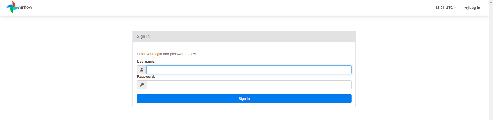

# MAIN

- code pushed to repo
- cicd takes repo with dags and dependencies and stores it in dags s3 (allows s3 dags history and versioning and backup)
- cicd ssh into ec2, sync dags with running airflow
- dags extracts and transforms data and saves in staging s3
- dag loads staging s3 transform into rds
- dynamically generated dags with yml


# AWS Services Setup

**Note**: Everything is being done with the free tier of AWS.


## Setting up IAM

The first thing to do is to set up an IAM user group and user so that you can enable the bare minimum permisssions needed to get this project running, following best practices. The user group that will be created is for a developer that is able to read and write to the s3 buckets and RDS database. The following series of steps will be done in the root user.


**Permissions needed for this project**:

- Read write s3

- Permissions to EC2

- Permissions to RDS


**Create a user**:

- IAM > Users > Create User 

-  Create a name for the user, in this case the name will be  `data-pipeline`

- We will attach this user to a group for best practices, as outlined by AWS, or replicating an instance where there are mulitple users in a group

- Create user


**Create a user group**:

- IAM > User groups > Create group

- Create a name for the group, in this case the name will be `data-pipeline-group`

- Add the user created to this group 

- Create user group

**Create a policy**:

- Create a policy which has the necessary permissions needed

- IAM > Policies > Create a policy

- Add the following permissions to the IAM policy:
```json
{
    "Version": "2012-10-17",
    "Statement": [
        {
            "Sid": "S3Access",
            "Effect": "Allow",
            "Action": [
                "s3:GetObject",
                "s3:PutObject",
                "s3:ListBucket"
            ],
            "Resource": [
                "arn:aws:s3:::your-bucket-name",
                "arn:aws:s3:::your-bucket-name/*"
            ]
        },
        {
            "Sid": "RDSAccess",
            "Effect": "Allow",
            "Action": [
                "rds:DescribeDBInstances",
                "rds:DescribeDBClusters",
                "rds:ModifyDBInstance",
                "rds:ModifyDBCluster",
                "rds-data:ExecuteStatement",
                "rds-data:BatchExecuteStatement"
            ],
            "Resource": "arn:aws:rds:*:*:db:your-db-instance-identifier"
        }
    ]
}

```

- We want the IAM group to only have access to the dag and staging data s3 buckets and the RDS database, nothing else. to ensure that, the resource has to be stated in the IAM json template. As for now, those have not been created so it can be replaced with `"Resource": "*"` and once created, this can be modified to point to the right location.


- Add policty name, in this case the name will be `data-pipeline-policy`

- Create policy


**Attach policy to group**:

- Go to the `data-pipeline-group` created and select the permissions tab

- Add permissions

- Search for `data-pipeline-policy`

- Attach policies


## Setting up S3 Bucket

Two S3 buckets will be created, one for the staging data and one for the dags. When following the steps, make sure you are in the location you want to be in. For this project, `eu-west-2` will be used.

- S3 > Buckets > Create bucket > General purpose 

- Add bucket name, in this case the bucket name will be `data-pipeline-airflow-dags-2`

- Create bucket

Likewise, one for staging data can be created using the bucket name `data-pipeline-staging-data-2`


## Setting up RDS

###  Initial setup

The RDS will be used to store the final datasets.

- RDS > Create database 

- Select the PostgreSQL database

- Select the free tier template

- Add a database name, in this case the name will be `data-pipeline-database`

- Add a master username and password

- Select `db.t3.micro` for the instance configuration

- Select `General Purpose SSD (gp2)` for storage 

- Disable storage autoscaling

- Select `Default VPC` for connectivity and `default` subnet group 

- Allow public acces to the RDS

- Under additional configuration, create an initial database name. In this case, it will be `data_pipeline_db`

- Create database

### Setting up connectivity

- Click on the database that has been created

- Click on the link under Security > VPC security groups

- Go to inbound rules

- Click on Edit inbound rules

- Add rule 
    - Allow Custom TCP, port 8080, My IP

- Save rules


## Setting up EC2

###  Initial setup

The EC2 instance will be used as a server for Airflow

- EC2 > Launch Instance

- Add a server name, in this case the EC2 name will be `airflow-server`

- Click on `Ubuntu` for the OS image

- Leave the AMI as free tier image

- Select `t2.small` for the instance type, to ensure enough memory to run Airflow

- Create new key-pair login, in this case the name used will be `data-pipeline-key-pair` for the RSA OpenSSH key pair.

- Under network settings, select the check boxes
    - Allow HTTPS traffic from the internet
    - Allow HTTP traffic from the internet

- Launch instance

### Setting up connectivity

- Instances > Security

- Click on the security groups link

- Click Edit inbound rules

- Add rule 
    - Allow Custom TCP, port 8080, My IP

- Save rules

### Adding Elastic IP

An elastic ip stays static and will not change which is useful.

On the EC2 dashboard:

- Elastic IPs > Allocate Elastic IP address > Allocate

Then click on the airflow instance to assoociate it with the elastic ip.


# Downloading AWS CLI

The AWS CLI will be used frequently when accessing AWS services via the command line, It can be downloaded by following the instructions on the AWS website or by running the following command:

```linux
curl "https://awscli.amazonaws.com/awscli-exe-linux-x86_64.zip" -o "awscliv2.zip"

unzip awscliv2.zip

sudo ./aws/install
```

# Setting up Airflow

## Connecting to the EC2

- Check the ec2 instance created and click connect

- Using the downloaded key pair and the instructions given by AWS, connect to the ec2 instance. The SSH command will look similar to below:

```linux
ssh -i "data-pipeline-key-pair.pem" ubuntu@{public dns}
```
After running the command using the key pair pem, the connection should be successful.

## Downloading Airflow on the EC2


The first thing to do in the new EC2 instance is to run an update to install the latest packages

```python
# Update the package list
sudo apt-get update

# Install Python, pip, and other necessary packages
sudo apt-get install -y python3 python3-pip python3-dev libmysqlclient-dev build-essential
```

Next, a virtual environment will need to be created which will allow for the set up of the virtual env.

```
sudo  apt install python3.12-venv

python3 -m venv venv
```

The virtual python environment can be accessed with the following command

```
source venv/bin/activate
```

It is useful to upgrade pip in the virtual environment

```
pip install --upgrade pip setuptools wheel
```

Now, airflow can be downloaded

```
pip install apache-airflow
```

After downloading airflow, airflow can be run as follows

- Initialise the DB

```
airflow db init
```

- Create an airflow user

```
airflow users create \
    --username admin \
    --password admin \
    --firstname First \
    --lastname Last \
    --role Admin \
    --email admin@example.com
```

- Start the Airflow webserver

```
airflow webserver -p 8080 -D
```

- Start the Airflow scheduler

```
airflow scheduler -D
```

To see if airflow is running via the cli, you can run the following command and look at the status

```
ps aux | grep airflow
```

Now that airflow is up and running, the webserver UI can be accessed by going onto the EC2 url and opening it with the extension `:8080`, e.g. `http://your_ec2_public_ip:8080`. The website should look like this. Another way to access the website is with the elastic ip created, where the url will be `http://your_elastic_ip:8080`



Once you have logged in with your credentials, you can access airflow.

To remove all the example dags that airflow offers by default, go to the airflow config file and set `load_examples = False`

```
nano ~/airflow/airflow.cfg
```

Set the command and

```
source ~/airflow/airflow.cfg
```

After this, airflow services needs to be restarted

```python
# Restart the webserver
pkill -f "airflow webserver"
pkill -f "airflow scheduler"

# Restart the webserver and scheduler
airflow webserver -p 8080 -D
airflow scheduler -D
```

Finally, to ensure airflow starts up when the ec2 is turned on, run the following

```
sudo nano /etc/systemd/system/airflow-webserver.service
```

Add this to the file

```python
[Unit]
Description=Airflow webserver daemon
After=network.target

[Service]
User=ubuntu
Group=ubuntu
Environment="PATH=/home/ubuntu/venv/bin"
ExecStart=/home/ubuntu/venv/bin/airflow webserver --pid /home/ubuntu/airflow/airflow-webserver.pid
Restart=always
RestartSec=5s

[Install]
WantedBy=multi-user.target

```

Similarly,


```
sudo nano /etc/systemd/system/airflow-scheduler.service
```

```python
[Unit]
Description=Airflow scheduler daemon
After=network.target

[Service]
User=ubuntu
Group=ubuntu
Environment="PATH=/home/ubuntu/venv/bin"
ExecStart=/home/ubuntu/venv/bin/airflow scheduler --pid /home/ubuntu/airflow/airflow-scheduler.pid
Restart=always
RestartSec=5s

[Install]
WantedBy=multi-user.target
```


When booting up run

```python
# Enable services
sudo systemctl enable airflow-webserver
sudo systemctl enable airflow-scheduler

# Start services
sudo systemctl start airflow-webserver
sudo systemctl start airflow-scheduler
```

Verify the services are running 

```
sudo systemctl status airflow-webserver
sudo systemctl status airflow-scheduler
```


## Downloading AWS CLI on EC2

Run the commands found in the `Downloading AWS CLI` section

## Set up IAM Credentials on EC2


Now the AWS credentials need to be set up to allow the ec2 instance to interact with the other aws services like the s3 bucket and rds.

- IAM > Users

- Create access key

- Save access key details


In the bashrc file of the EC2 instance, export the access key variables and source them.

```
export AWS_ACCESS_KEY_ID='your_access_key'
export AWS_SECRET_ACCESS_KEY='your_secret_key'
```

After, ensure the following airflow aws package is installed to interact with AWS services

```
pip install apache-airflow-providers-amazon
```


# Setting up CI/CD


GitHub actions pipeline needs to:

- Push new dag and requirements changes to the dags s3 bucket

- Connect to the EC2 instance 

- Sync s3 bucket changes to the EC2 airflow


## Set up

- Go to the GitHub repo with your dags and other files and click on the settings button

- Secrets and variables > Actions > New repository secret

- Add the following variables in secrets to ensure the pipeline can run the aws services as intended
    - AWS_ACCESS_KEY_ID: Your AWS access key ID.
    - AWS_SECRET_ACCESS_KEY: Your AWS secret access key.
    - AWS_REGION: The AWS region where your S3 bucket is located.
    - S3_BUCKET: The name of your S3 bucket.
    - EC2_INSTANCE: The public DNS or IP address of your EC2 instance (better yet use the elastic ip address so it does not change. If set up, it will do it automatically)
    - SSH_PRIVATE_KEY: Your EC2 instance's SSH private key.
    - EC2_USER: The username for SSH access to your EC2 instance.


After adding the keys, create a GitHub actions workflow

- Create a new workflow file in the repository at `.github/workflows/deploy-dags.yml`


# Improvements

- improvement: set up VPC

IS S3 USED TO STORE DAGS FOR VERSIONING? DO WE SYNC OUR BUCKET TO OUR AIRFLOW DAGS FOLDER? IT IS FASTER YES BUT WHAT ABOUT SCALABILITY? IS THAT WHAT THE EBS IS USED FOR? ENABLE BUCKET VERSIONING FOR s3 for dags?